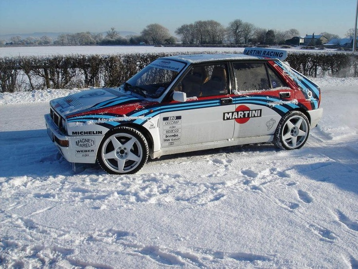

I am Mert, a software developer from Montréal, Canada. If you are interested in my professional career, take a look at my [Linkedin profile](https://www.linkedin.com/in/amertkara "my Linkedin profile"). 

My professional career somehow shaped around web application development (Python+Django) specifically in the back-end because of the industry. I started using Python during my Masters which is good for automating and chaining. I would recommend anyone to learn Python, it is the ultimate scripting language in my opinion. Just run 

`python -m SimpleHTTPServer` 

and you will see what I mean ;) That being said, my main interests C++, make, shell. I like to devote my spare time and energy in developing open source libraries to add my mere support in the C++ community.

I always have been a big fan of Counter-Strike, which is by far the best online gaming experience I ever had. I used to have a clan with my friends and a dedicated server, I do miss those days. It makes me happy that there are still hundreds of CS servers with tons of players. I don't want to sound like a cranky old man, but I have no interest in the releases after 1.6. Not that I am happy with 1.6, especially those ridiculous weapon additions.  I also play new games, the ones that you buy and finish in 4 hours with a lousy online experience (except for GTA and Battlefield).

I also play soccer, cook and am in love with the beauty below.

